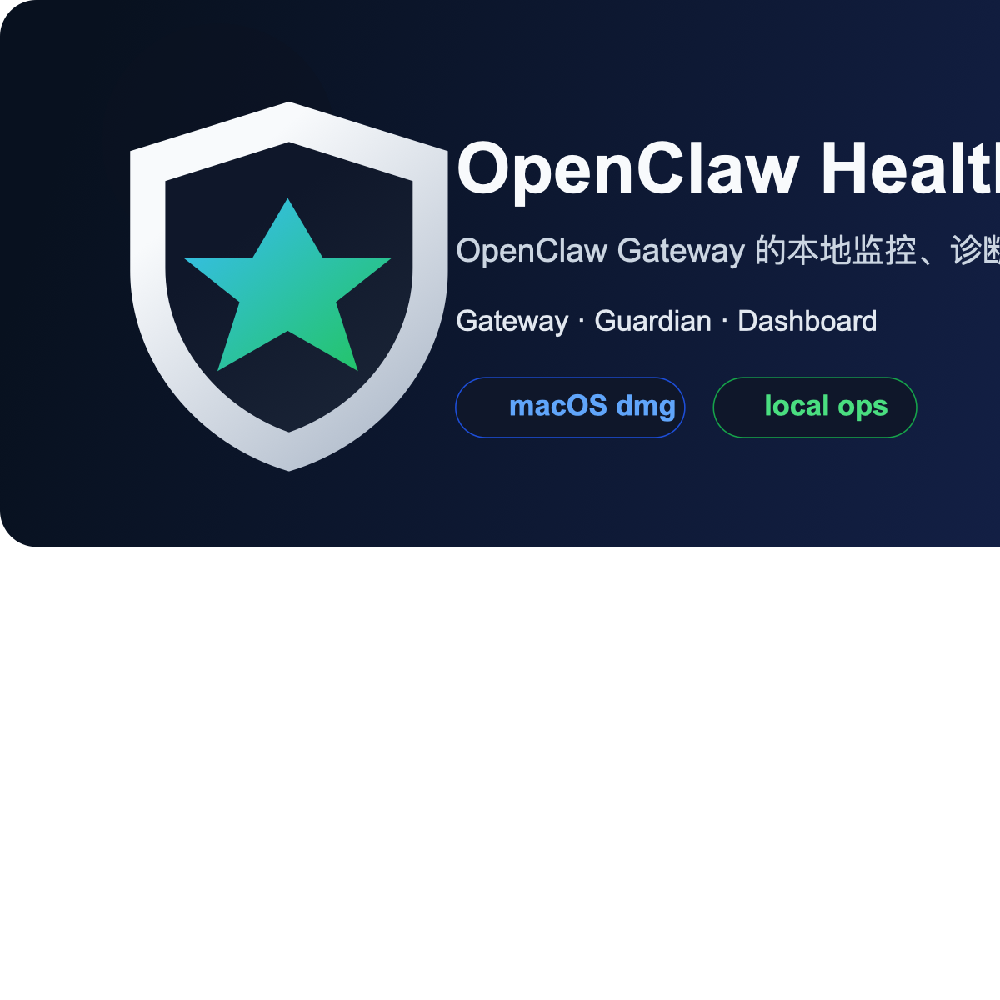

# OpenClaw Health Monitor

<p align="center">
  
</p>

<p align="center">
  OpenClaw Gateway 的本地监控、诊断与恢复控制台
</p>

<p align="center">
  <a href="https://github.com/DreamOfXM/openclaw-health-monitor/releases/latest">
    
  </a>
  <a href="https://github.com/DreamOfXM/openclaw-health-monitor/releases/latest/download/openclaw-health-monitor-macos-arm64.dmg">
    
  </a>
  <a href="https://github.com/DreamOfXM/openclaw-health-monitor/releases/latest/download/openclaw-health-monitor-macos-arm64.app.zip">
    
  </a>
  <a href="https://github.com/DreamOfXM/openclaw-health-monitor/actions/workflows/release.yml">
    
  </a>
  <a href="https://github.com/DreamOfXM/openclaw-health-monitor/blob/main/LICENSE">
    
  </a>
</p>

<p align="center">
  
  
  
  
  
</p>

中文 | [English](#english)

## 中文

OpenClaw Health Monitor 是一个面向 OpenClaw Gateway 的本地监控与恢复工具。
它把 `Gateway`、`Guardian`、`Dashboard` 组合成一套可以直接启动、直接停止、直接定位问题的本地控制台。

当前开源版聚焦五类能力：

- 本地运行面：统一启动、停止、状态检查、预检、回归验证
- 守护恢复：健康检查、异常识别、告警去重、受控恢复
- 任务控制面：任务注册表、合同校验、缺失回执识别、阻塞判定
- 版本治理：主用版 / 验证版切换、隔离验证、单激活环境约束
- 观测面板：Dashboard 展示环境状态、控制队列、会话裁决、学习中心

它兼容两类 OpenClaw 运行方式：

- 单 agent：关注是否长时间无最终回复、是否出现无可见回复、是否需要主动进度播报
- 多 agent：在上述基础上继续识别阶段切换、阶段停滞、长任务升级播报

适合两类人：

- 小白用户：下载后直接启动，看到当前是否正常、哪里异常、要不要处理
- 技术用户：查看运行链路、异常归因、恢复动作、内存归因和本地状态

## 快速开始

### 方式一：脚本启动

前置条件：

- macOS
- 已安装并可运行 `openclaw`
- Python 3.9+

启动：

```bash
cd ~/openclaw-health-monitor
./install.sh
./start.sh
```

常用命令：

```bash
cd ~/openclaw-health-monitor
./start.sh
./status.sh
./verify.sh
./stop.sh
```

### 方式二：桌面 App

直接下载：

- [下载 dmg](https://github.com/DreamOfXM/openclaw-health-monitor/releases/latest/download/openclaw-health-monitor-macos-arm64.dmg)
- [下载 app zip](https://github.com/DreamOfXM/openclaw-health-monitor/releases/latest/download/openclaw-health-monitor-macos-arm64.app.zip)

桌面 App 行为：

- 打开 App：自动拉起 Gateway、Guardian、Dashboard
- 退出 App：停止 Gateway、Guardian、Dashboard

当前桌面 App 仍然依赖本机已准备好 `~/openclaw-health-monitor` 仓库和运行环境。

## 这个项目是干什么的

可以把它理解成 OpenClaw Gateway 的本地值班台：

- `Gateway`
  真正提供 OpenClaw 能力的核心服务
- `Guardian`
  后台守护进程，负责健康检查、异常识别、告警、主动进度播报和受控恢复
- `Dashboard`
  本地网页控制台，负责展示状态、问题定位、错误日志和操作入口

如果你只关心"怎么用"，记住这四个命令就够了：

```bash
./install.sh
./start.sh
./status.sh
./stop.sh
```

## 维护约定

- `dashboard_v2/` 是当前唯一主控制台前端；不要再把旧的 `dashboard.py` 当成主 UI 继续扩展
- `dashboard_backend.py` 是 Dashboard V2 背后的兼容数据层；环境、任务、学习、shared-state 等真实能力继续从这里和 `state_store.py` 提供
- 当前迁移工作分支是 `dashboard-v2-primary-console`；在合并到 `main` 之前，后续控制台维护默认继续在这个分支上进行
- 本地运行数据不再纳入版本管理：`.learnings/*.md`、`MEMORY.md`、`memory/*.md`、`data/shared-state/*.json`、`data/current-task-facts.json`、`data/task-registry-summary.json`、`data/*.db-shm`、`data/*.db-wal`
- `data/shared-state/README.md` 仍保留在仓库中，用来说明 shared-state 目录结构；其余运行态 JSON 只作为本机事实源，不作为源码提交内容
- 持续维护时可参考 `docs/dashboard-v2-maintenance-checklist.md`

## 功能概览

### 1. 本地运行与守护

- `./start.sh` / `./stop.sh` / `./status.sh` / `./verify.sh`
- `Guardian` 周期性检查 Gateway、运行日志和本地状态
- 对无回复、阶段停滞、异常退出、健康检查失败进行识别和记录
- 支持钉钉、飞书和 macOS 本地通知

### 2. Dashboard 控制台

Dashboard 负责提供本地操作和诊断视图，当前包括：

- 版本环境面板
- 最近异常
- 任务注册表
- 控制面健康
- 控制队列
- 会话裁决
- 活跃代理
- 学习中心 / 反思记录
- 配置管理与恢复入口

### 3. 任务注册表与控制面

这部分能力完全位于 Health Monitor 外挂层，不要求改 OpenClaw 源码。

- 为复杂任务分配本地 `task_id`
- 将 `session_key`、阶段、回执、阻塞原因写入 SQLite
- 根据 `task_contracts.json` 校验结构化回执
- 将缺失回执转成持久化 `task_control_actions`
- 用控制状态而不是模型自由文本来驱动进度判断
- 对长期拿不到关键回执的任务转为阻塞态

### 4. 版本治理

- 支持主用版与验证版两套 OpenClaw 路径
- 支持隔离状态目录、隔离 token、隔离 Control UI
- 支持在 Dashboard 中切换当前守护目标
- 同一时间只允许一个 Gateway 处于激活运行态

### 5. 进度治理机制（本轮新增落地）

这轮实现把"有方案 ≠ 开发已启动、 有开发 ≠ 测试已启动、缺少回执 ≠ 可宣称推进"真正落成了代码约束：

- **统一结构化回执协议**：`PIPELINE_RECEIPT` 必须包含 `agent / phase / action / evidence`，并补齐 `ack_id`
- **状态机推进规则**：`planning_only / dev_running / awaiting_test / test_running / blocked_* / completed_verified` 由真实 receipt 驱动
- **超时守护 / 缺失回执判定**：在宽限期后生成 `task_control_actions`，默认记录 follow-up 或直接阻塞
- **单一事实源**：对外查询统一读取 `data/current-task-facts.json`
- **用户可见文案绑定**：新增 `user_visible_progress`，由 `control_state + missing_receipts + contract` 决定，而不是口头猜测
- **A 股闭环优先覆盖**：新增 `a_share_delivery_pipeline` 合同，专门约束 `A股 / 闭环采样 / 采样策略` 这类开发交付任务

当前推荐的外部查询口径：

- 先读 `data/current-task-facts.json`
- 只根据 `approved_summary / user_visible_progress / control_state / next_action / missing_receipts` 回答
- 当 `control_state=planning_only` 时，只能说"方案已完成，但开发尚未启动"
- 当缺少 `dev/test` receipt 时，禁止说"开发/测试正在推进"

## 架构说明

完整架构图与任务状态流转图见：

- [docs/architecture.md](./docs/architecture.md)

### 核心组件

- `guardian.py`
  后台守护进程。负责健康检查、异常识别、主动进度播报、自动恢复、通知和变更记录。

- `dashboard_v2/`
  当前唯一主控制台前端。负责页面、交互、三视图结构和操作入口。

- `dashboard_backend.py`
  Dashboard V2 的后端兼容层。继续复用环境、任务、学习、共享状态、快照和版本治理的真实数据接口。

- `desktop_runtime.sh`
  本地总控脚本。负责统一启动、停止、查询：
  - Gateway
  - Guardian
  - Dashboard

- `monitor_config.py`
  配置加载层。支持：
  - `config.conf`
  - `config.local.conf`
  - 环境变量覆盖

- `state_store.py`
  基于 SQLite 的本地状态库，用于保存：
  - alerts
  - versions
  - change events
  - health samples
  - managed tasks
  - task events
  - task contracts
  - task control actions

### 运行模型

1. `./start.sh`
   调用 `desktop_runtime.sh start all`

2. `desktop_runtime.sh`
   依次拉起 Gateway、Guardian、Dashboard，并记录 PID 文件

3. `Guardian`
   持续轮询 Gateway 和运行日志，识别长时间无回复、阶段停滞、网关异常，并在长任务场景下主动推送进度或升级播报

4. `Dashboard`
   提供本地问题定位面板、最近异常、内存归因、快照操作，以及多版本 OpenClaw 环境管理

5. `./stop.sh`
   调用 `desktop_runtime.sh stop all`，停止整套本地运行面

### 任务注册表

Health Monitor 现在还提供一层外挂式任务注册表，不修改 OpenClaw 源码。

默认行为：

- 对复杂任务自动生成本地 `task_id`
- 将任务与 `session_key`、当前阶段、最近回执、阻塞原因绑定到本地 SQLite
- 同一会话默认只保留 1 个当前活动任务，其余任务转为后台任务
- 当用户发 `?`、`进度`、`到哪了` 这类追问时，后续会优先基于注册表判断，而不是完全依赖模型脑补上下文

关键点：

- 注册表属于守护层，不侵入 OpenClaw
- 默认存储在 `data/monitor.db`
- 任务合同默认来自 `task_contracts.json`
- 每轮同步后还会额外生成 `data/task-registry-summary.json`
- 守护者还会生成 `data/current-task-facts.json`，作为进度查询的事实源
- 默认开启，可通过 `ENABLE_TASK_REGISTRY` 关闭
- 当前活动任务、最近任务和时间线会展示在 Dashboard 页面中
- 也可以通过 `/api/task-registry` 获取结构化摘要，而不是只从整包 `/api/status` 中手动拆字段

### 控制面与学习中心

在任务注册表之上，Dashboard 还会展示：

- 控制面健康摘要
- 控制队列
- 会话裁决结果
- 学习中心摘要
- 反思运行记录

这些能力的目标是把"任务是否真的还在推进"从模型口头描述，收敛到可追踪的本地事实。

当前可配置项：

- `ENABLE_TASK_REGISTRY`
- `TASK_REGISTRY_MAX_ACTIVE`
- `TASK_REGISTRY_RETENTION`
- `TASK_CONTRACTS_FILE`
- `TASK_CONTROL_RECEIPT_GRACE`
- `TASK_CONTROL_FOLLOWUP_COOLDOWN`
- `TASK_CONTROL_MAX_ATTEMPTS`
- `TASK_CONTROL_BLOCK_TIMEOUT`
- 这时页面展示可能会短暂落后于真实进程状态，建议重新通过 Dashboard 切换一次，或手动同步配置后再继续使用

任务合同默认分三类：

- `delivery_pipeline`
  - 要求出现 `pm -> dev -> test` 的结构化回执
- `quant_guarded`
  - 要求出现 `calculator -> verifier` 的结构化回执
- `single_agent`
  - 不要求强制多代理合同

这层能力遵循 OpenClaw 官方边界：

- 不修改 OpenClaw 源码
- 不假设 Feishu 私聊天然支持持久线程绑定
- 继续使用官方 `sessions_spawn` / `allowAgents` / `runTimeoutSeconds` / `messages.queue.mode`
- 任务合同、ACK 裁决、阻塞判定都放在守护者外挂层

## 运行验证

完成安装或升级后，可按下面顺序验证本地监控是否正常工作。

### 1. 基础启动验证

```bash
cd ~/openclaw-health-monitor
./preflight.sh
./start.sh
```

检查项：

- Dashboard 首页可以正常加载
- `Guardian` 和 `Gateway` 状态可见
- 最近异常区和问题定位区没有前端报错

### 2. 异常识别验证

关注这些场景是否会进入变更日志和首页异常区：

- `dispatch complete (queuedFinal=false, replies=0)` 会被识别为"任务完成但没有可见回复"
- `gateway closed (1006 ...)` 会被识别为 `gateway_ws_closed`
- `abort failed ... no_active_run` 会被识别为任务状态追踪异常
- 长时间只有 `dispatching to agent` 没有 `dispatch complete` 时，会出现"任务长时间无最终结果"
- 长时间停留在同一个 `PIPELINE_PROGRESS` 阶段时，会出现"任务阶段长时间无进展"

Guardian 同时支持单 agent / 多 agent：

- 单 agent 场景：
  - 长时间无最终回复会被识别为 `dispatch_stuck`
  - 没有可见回复会被识别为 `no_reply`
- 多 agent 场景：
  - 会继续识别 `PIPELINE_PROGRESS` 阶段是否长时间无推进
  - 并可对长任务主动做进度推送和升级播报

### 2.1 轮询与主动进度推送

Guardian 不是被动看板，而是会按固定间隔轮询运行状态和运行日志。

默认相关配置：

- `CHECK_INTERVAL`
  - 轮询检查间隔
- `SLOW_RESPONSE_THRESHOLD`
  - 慢响应阈值
- `STALLED_RESPONSE_THRESHOLD`
  - 无回复 / 卡住阈值
- `PROGRESS_PUSH_INTERVAL`
  - 长时间无新进展后的首次主动推送阈值
- `PROGRESS_PUSH_COOLDOWN`
  - 两次主动进度推送之间的冷却时间
- `PROGRESS_ESCALATION_INTERVAL`
  - 长时间无新进展后的升级播报阈值
- `GUARDIAN_FOLLOWUP_TIMEOUT / GUARDIAN_FOLLOWUP_RETRIES / GUARDIAN_FOLLOWUP_RETRY_DELAY`
  - 会话内守护追问的超时、重试和降级兜底配置

设计目标：

- 用户不用反复追问"现在做得怎么样了"
- Guardian 先看运行日志里是否真的长期没有新进展，而不是机械按短周期刷屏
- 对长时间无新进展的任务，Guardian 会优先在原会话里发带标记的系统追问；如果会话追问超时，会自动降级为直接进度推送
- 如果静默时间继续拉长，Guardian 会升级播报，而不是静默等待

### 3. 内存归因验证

首页内存区会明确显示：

- `Top 15 进程`
- `Kernel / Wired`
- `Compressed`
- `Other System`

也会直接告诉你：

- `Top 15` 覆盖了多少已用内存
- 还有多少属于系统/缓存/未归属项

### 4. 通知验证

如果已经配置钉钉或飞书 webhook，检查：

- 异常首次出现时会发送通知
- 同类异常在去重窗口内不会刷屏

### 5. 快速回归验证

```bash
python3 -m unittest discover -s tests
```

在线验收可直接运行：

```bash
cd ~/openclaw-health-monitor
./verify.sh
```

## GitHub Actions

仓库已经提供 macOS 构建 workflow：

- `.github/workflows/release.yml`
- `.github/release.yml`

它会自动完成：

- 安装 Python 依赖
- 安装 `pnpm`
- 安装 Rust toolchain
- 运行测试
- 构建桌面 App
- 整理 `.dmg` 和 `.app.zip`
- 上传为 workflow artifacts

当仓库 push `v*` tag 时，workflow 会把 `release/` 里的文件自动附加到 GitHub Release。

推荐发布步骤：

```bash
cd ~/openclaw-health-monitor
make test
make pake
make release
```

## English

OpenClaw Health Monitor is a local monitoring, diagnosis, and recovery console for OpenClaw Gateway.
It runs three parts together as a local control plane:

- `Gateway`: the core OpenClaw runtime
- `Guardian`: the background watcher for health checks, anomaly detection, alerts, and controlled recovery
- `Dashboard`: the local control plane UI for status, logs, and operator actions

It is designed for two groups:

- non-technical users who want a simple start / stop / status workflow
- technical users who want to inspect runtime health, recovery behavior, recent anomalies, and memory attribution

The open source edition currently focuses on five capability areas:

- local runtime control: start, stop, status, preflight, and verification
- guardian recovery: health checks, anomaly detection, alert deduplication, and controlled recovery
- task control plane: task registry, contract checks, missing-receipt detection, and blocked-task decisions
- version governance: primary / validation switching, isolated validation, and single-active-environment enforcement
- operator dashboard: environment status, control queue, session resolution, and learning center

## Quick Start

### Option 1: Script Startup

Requirements:

- macOS
- a working `openclaw` command
- Python 3.9+

Start the full stack:

```bash
cd ~/openclaw-health-monitor
./install.sh
./start.sh
```

Common commands:

```bash
cd ~/openclaw-health-monitor
./start.sh
./status.sh
./verify.sh
./stop.sh
```

### Option 2: Desktop App

Direct downloads:

- [Download dmg](https://github.com/DreamOfXM/openclaw-health-monitor/releases/latest/download/openclaw-health-monitor-macos-arm64.dmg)
- [Download app zip](https://github.com/DreamOfXM/openclaw-health-monitor/releases/latest/download/openclaw-health-monitor-macos-arm64.app.zip)

Desktop app behavior:

- open the app: automatically start Gateway, Guardian, and Dashboard
- quit the app: stop Gateway, Guardian, and Dashboard

The current desktop app still assumes the local repository and runtime environment already exist at `~/openclaw-health-monitor`.

## What This Project Does

You can think of this project as the local operator console for OpenClaw Gateway:

- `Gateway`
  the service that actually does the work
- `Guardian`
  the watcher that checks health, detects anomalies, records incidents, and performs controlled recovery
- `Dashboard`
  the UI that shows current status, problem focus, recent incidents, and operator actions

If you only care about daily usage, these are the four commands that matter most:

```bash
./install.sh
./start.sh
./status.sh
./verify.sh
./stop.sh
```

## Feature Overview

### 1. Local Runtime And Guardian

- `./start.sh` / `./stop.sh` / `./status.sh` / `./verify.sh`
- `Guardian` periodically checks Gateway health, runtime logs, and local state
- anomalies such as no visible reply, stage stalls, abnormal exits, and health failures are recorded and surfaced
- DingTalk, Feishu, and macOS local notifications are supported

### 2. Dashboard

The Dashboard provides the local operator view for:

- version environments
- recent incidents
- task registry
- control-plane health
- control queue
- session resolution
- active agents
- learning center / reflection history
- config and recovery entry points

### 3. Task Registry And Control Plane

This layer stays outside OpenClaw core and does not require patching OpenClaw itself.

- assigns a local `task_id` to complex tasks
- stores `session_key`, stage, receipts, and blocked reason in SQLite
- validates structured receipts against `task_contracts.json`
- persists missing steps as `task_control_actions`
- uses approved control state instead of free-form model narration for progress decisions
- marks tasks as blocked when required receipts never arrive

### 4. Version Governance

- supports separate primary and validation OpenClaw paths
- supports isolated state, isolated token, and isolated Control UI for validation
- supports switching the guarded target in the Dashboard
- enforces that only one Gateway is active at a time

## Architecture

For the full architecture and task-state diagrams, see:

- [docs/architecture.md](./docs/architecture.md)

### Core Components

- `guardian.py`
  Background daemon responsible for health checks, anomaly detection, recovery logic, notifications, and change logs.

- `dashboard_v2/`
  The primary control-console frontend. It owns the pages, interaction model, and operator workflows.

- `dashboard_backend.py`
  The backend compatibility layer behind Dashboard V2. It continues to expose the real environment, task, learning, shared-state, snapshot, and promotion interfaces.

- `desktop_runtime.sh`
  The local runtime controller that starts, stops, and inspects:
  - Gateway
  - Guardian
  - Dashboard

- `monitor_config.py`
  Config loader with support for:
  - `config.conf`
  - `config.local.conf`
  - environment variable overrides

- `state_store.py`
  SQLite-backed local state storage for:
  - alerts
  - versions
  - change events
  - health samples

### Runtime Model

1. `./start.sh`
   calls `desktop_runtime.sh start all`

2. `desktop_runtime.sh`
   starts Gateway, Guardian, and Dashboard in order and records PID files

3. `Guardian`
   keeps checking Gateway health, scans runtime anomalies, records changes, and sends notifications

4. `Dashboard`
   exposes the local problem-focus view, recent anomalies, memory attribution, and snapshot actions

5. `./stop.sh`
   calls `desktop_runtime.sh stop all` and stops the whole local stack

## Maintenance Notes

- `dashboard_v2/` is the only primary control-console frontend now; do not keep extending the old `dashboard.py` as if it were the main UI
- `dashboard_backend.py` is the compatibility data layer behind Dashboard V2; real environment, task, learning, and shared-state capabilities still come from there and `state_store.py`
- the current migration branch is `dashboard-v2-primary-console`; until this work lands in `main`, treat that branch as the default place for ongoing console maintenance
- local runtime artifacts are no longer source-controlled: `.learnings/*.md`, `MEMORY.md`, `memory/*.md`, `data/shared-state/*.json`, `data/current-task-facts.json`, `data/task-registry-summary.json`, `data/*.db-shm`, and `data/*.db-wal`
- `data/shared-state/README.md` stays in git to document the shared-state contract; the rest of the runtime JSON files remain local machine facts rather than repository source
- use `docs/dashboard-v2-maintenance-checklist.md` as the quick maintenance baseline

Important:

- when you switch environments through the Dashboard, both `ACTIVE_OPENCLAW_ENV` and the local SQLite state are updated together
- if you bypass Health Monitor and start or stop Gateway manually through raw scripts, `launchd`, or other external commands, the local database may not immediately reflect the real active environment
- in that case the UI can temporarily lag behind the actual process state; switch once again through the Dashboard or resync the config before relying on the panel

### Task Registry

Health Monitor also provides an external task registry layer without patching OpenClaw itself.

Task registry highlights:

- external task contracts come from `task_contracts.json`
- every complex task is evaluated against a contract, not against free-form model text
- every missing receipt becomes a persisted control action in SQLite
- Guardian consumes those control actions and either retries, blocks, or approves the next summary
- `current-task-facts.json` becomes the source of truth for progress queries
- weak evidence tasks can be escalated into explicit blocked states when receipts never arrive

Built-in contracts:

- `delivery_pipeline`
  - requires `pm -> dev -> test` receipts
- `quant_guarded`
  - requires `calculator -> verifier` receipts
- `single_agent`
  - no strict multi-agent contract

Control-plane behavior:

- `task_control_actions` stores the current missing step for each active task
- Guardian retries against the current action instead of blindly trusting chat text
- dashboard and progress summaries read the approved control state, not raw model narration
- if the required receipts never arrive, the task is marked blocked instead of being described as "still progressing"

Default behavior:

- complex tasks get a local `task_id`
- each task is linked to its `session_key`, current stage, latest receipt, and blocked reason in local SQLite
- each session keeps one current active task by default, while older tasks move to the background
- future follow-up queries like `?`, `progress`, or `where are we` can be answered from the registry instead of relying entirely on model memory

Key points:

- the registry belongs to the guardian layer, not OpenClaw core
- it is stored in `data/monitor.db`
- each sync also writes a compact `data/task-registry-summary.json`
- it is enabled by default and can be turned off with `ENABLE_TASK_REGISTRY`
- the current active task, recent tasks, and task timeline are shown in the Dashboard
- external consumers can read `/api/task-registry` instead of scraping the full `/api/status` payload

Current config knobs:

- `ENABLE_TASK_REGISTRY`
- `TASK_REGISTRY_MAX_ACTIVE`
- `TASK_REGISTRY_RETENTION`

### Control Plane And Learning Center

On top of the task registry, the Dashboard also exposes:

- control-plane health summary
- control queue
- session resolution
- learning center summary
- reflection history

The purpose is to move progress judgement away from raw model narration and toward persisted local facts.

## Validation

After installation or upgrade, validate the local monitor in this order.

### 1. Basic Startup

```bash
cd ~/openclaw-health-monitor
./preflight.sh
./start.sh
```

Check that:

- the Dashboard loads correctly
- both `Guardian` and `Gateway` are visible
- the recent incidents section and problem-focus section render without frontend errors

### 2. Anomaly Detection

These runtime situations should become visible in the change log and the incident area:

- `dispatch complete (queuedFinal=false, replies=0)` becomes "completed without visible reply"
- `gateway closed (1006 ...)` becomes `gateway_ws_closed`
- `abort failed ... no_active_run` becomes a run-tracking anomaly
- long-running `dispatching to agent` without a final completion becomes "stuck without final result"
- being stuck in a single `PIPELINE_PROGRESS` stage becomes a stage-stuck anomaly

### 3. Memory Attribution

The homepage memory section should make memory usage explainable:

- `Top 15 Processes`
- `Kernel / Wired`
- `Compressed`
- `Other System`

It should also explain:

- how much of used memory is covered by the Top 15 processes
- how much remains in system/cache/unattributed memory

### 4. Notifications

If DingTalk or Feishu webhooks are configured, verify:

- the first occurrence of an anomaly triggers a notification
- repeated anomalies are deduplicated within the configured interval

### 5. Quick Regression

Run the local test suite:

```bash
python3 -m unittest discover -s tests
```

Run the online verification script:

```bash
cd ~/openclaw-health-monitor
./verify.sh
```

## GitHub Actions

The repository already includes a macOS release workflow:

- `.github/workflows/release.yml`
- `.github/release.yml`

It automatically handles:

- Python dependency installation
- `pnpm` setup
- Rust toolchain setup
- test execution
- desktop app build
- `.dmg` and `.app.zip` packaging
- workflow artifact upload

When a `v*` tag is pushed, the workflow attaches the generated files to the GitHub Release.

Recommended release flow:

```bash
cd ~/openclaw-health-monitor
make test
make pake
make release
```
