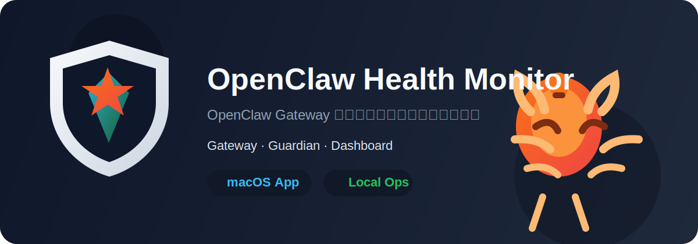

# OpenClaw Health Monitor

<p align="center">
  
</p>

<p align="center">
  OpenClaw Gateway 的本地监控、诊断与恢复控制台
</p>

<p align="center">
  <a href="https://github.com/DreamOfXM/openclaw-health-monitor/releases/latest">
    
  </a>
  <a href="https://github.com/DreamOfXM/openclaw-health-monitor/releases/latest/download/openclaw-health-monitor-macos-arm64.dmg">
    
  </a>
  <a href="https://github.com/DreamOfXM/openclaw-health-monitor/releases/latest/download/openclaw-health-monitor-macos-arm64.app.zip">
    
  </a>
  <a href="https://github.com/DreamOfXM/openclaw-health-monitor/actions/workflows/release.yml">
    
  </a>
  <a href="https://github.com/DreamOfXM/openclaw-health-monitor/blob/main/LICENSE">
    
  </a>
</p>

<p align="center">
  
  
  
  
  
</p>

中文 | [English](#english)

## 中文

OpenClaw Health Monitor 是一个面向 OpenClaw Gateway 的本地监控与恢复工具。  
它把 `Gateway`、`Guardian`、`Dashboard` 组合成一套可以直接启动、直接停止、直接定位问题的本地控制台。

适合两类人：

- 小白用户：下载后直接启动，看到当前是否正常、哪里异常、要不要处理
- 技术用户：查看运行链路、异常归因、恢复动作、内存归因和本地状态

## 快速开始

### 方式一：脚本启动

前置条件：

- macOS
- 已安装并可运行 `openclaw`
- Python 3.9+

启动：

```bash
cd ~/openclaw-health-monitor
./install.sh
./start.sh
```

常用命令：

```bash
cd ~/openclaw-health-monitor
./start.sh
./status.sh
./verify.sh
./stop.sh
```

### 方式二：桌面 App

直接下载：

- [下载 DMG](https://github.com/DreamOfXM/openclaw-health-monitor/releases/latest/download/openclaw-health-monitor-macos-arm64.dmg)
- [下载 App Zip](https://github.com/DreamOfXM/openclaw-health-monitor/releases/latest/download/openclaw-health-monitor-macos-arm64.app.zip)

桌面 App 行为：

- 打开 App：自动拉起 Gateway、Guardian、Dashboard
- 退出 App：停止 Gateway、Guardian、Dashboard

当前桌面 App 仍然依赖本机已准备好 `~/openclaw-health-monitor` 仓库和运行环境。

## 这个项目是干什么的

可以把它理解成 OpenClaw Gateway 的本地值班台：

- `Gateway`
  真正提供 OpenClaw 能力的核心服务
- `Guardian`
  后台守护进程，负责健康检查、异常识别、告警和受控恢复
- `Dashboard`
  本地网页控制台，负责展示状态、问题定位、错误日志和操作入口

如果你只关心“怎么用”，记住这四个命令就够了：

```bash
./install.sh
./start.sh
./status.sh
./stop.sh
```

## 架构说明

### 核心组件

- `guardian.py`
  后台守护进程。负责健康检查、异常识别、自动恢复、通知和变更记录。

- `dashboard.py`
  本地 Web UI。负责展示 Gateway / Guardian / Dashboard 状态、最近异常、内存归因、配置快照和操作入口。

- `desktop_runtime.sh`
  本地总控脚本。负责统一启动、停止、查询：
  - Gateway
  - Guardian
  - Dashboard

- `monitor_config.py`
  配置加载层。支持：
  - `config.conf`
  - `config.local.conf`
  - 环境变量覆盖

- `state_store.py`
  基于 SQLite 的本地状态库，用于保存：
  - alerts
  - versions
  - change events
  - health samples

### 运行模型

1. `./start.sh`
   调用 `desktop_runtime.sh start all`

2. `desktop_runtime.sh`
   依次拉起 Gateway、Guardian、Dashboard，并记录 PID 文件

3. `Guardian`
   持续检查 Gateway 是否正常、扫描运行时异常、记录变更并发送通知

4. `Dashboard`
   提供本地问题定位面板、最近异常、内存归因和快照操作

5. `./stop.sh`
   调用 `desktop_runtime.sh stop all`，停止整套本地运行面

## 运行验证

完成安装或升级后，可按下面顺序验证本地监控是否正常工作。

### 1. 基础启动验证

```bash
cd ~/openclaw-health-monitor
./preflight.sh
./start.sh
```

检查项：

- Dashboard 首页可以正常加载
- `Guardian` 和 `Gateway` 状态可见
- 最近异常区和问题定位区没有前端报错

### 2. 异常识别验证

关注这些场景是否会进入变更日志和首页异常区：

- `dispatch complete (queuedFinal=false, replies=0)` 会被识别为“任务完成但没有可见回复”
- `gateway closed (1006 ...)` 会被识别为 `gateway_ws_closed`
- `abort failed ... no_active_run` 会被识别为任务状态追踪异常
- 长时间只有 `dispatching to agent` 没有 `dispatch complete` 时，会出现“任务长时间无最终结果”
- 长时间停留在同一个 `PIPELINE_PROGRESS` 阶段时，会出现“任务阶段长时间无进展”

### 3. 内存归因验证

首页内存区会明确显示：

- `Top 15 进程`
- `Kernel / Wired`
- `Compressed`
- `Other System`

也会直接告诉你：

- `Top 15` 覆盖了多少已用内存
- 还有多少属于系统/缓存/未归属项

### 4. 通知验证

如果已经配置钉钉或飞书 webhook，检查：

- 异常首次出现时会发送通知
- 同类异常在去重窗口内不会刷屏

### 5. 快速回归验证

```bash
python3 -m unittest discover -s tests
```

在线验收可直接运行：

```bash
cd ~/openclaw-health-monitor
./verify.sh
```

## GitHub Actions

仓库已经提供 macOS 构建 workflow：

- `.github/workflows/release.yml`
- `.github/release.yml`

它会自动完成：

- 安装 Python 依赖
- 安装 `pnpm`
- 安装 Rust toolchain
- 运行测试
- 构建桌面 App
- 整理 `.dmg` 和 `.app.zip`
- 上传为 workflow artifacts

当仓库 push `v*` tag 时，workflow 会把 `release/` 里的文件自动附加到 GitHub Release。

推荐发布步骤：

```bash
cd ~/openclaw-health-monitor
make test
make pake
make release
```

## English

OpenClaw Health Monitor is a local monitoring and recovery console for OpenClaw Gateway.
It starts and manages three parts together:

- `Gateway`: the core OpenClaw runtime
- `Guardian`: the background watcher for health checks, anomaly detection, alerts, and controlled recovery
- `Dashboard`: the local control plane UI for status, logs, and operator actions

Quick links:

- [Download DMG](https://github.com/DreamOfXM/openclaw-health-monitor/releases/latest/download/openclaw-health-monitor-macos-arm64.dmg)
- [Download App Zip](https://github.com/DreamOfXM/openclaw-health-monitor/releases/latest/download/openclaw-health-monitor-macos-arm64.app.zip)
- [Latest Release](https://github.com/DreamOfXM/openclaw-health-monitor/releases/latest)

Common commands:

```bash
./install.sh
./start.sh
./status.sh
./verify.sh
./stop.sh
```
