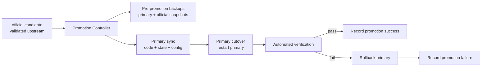
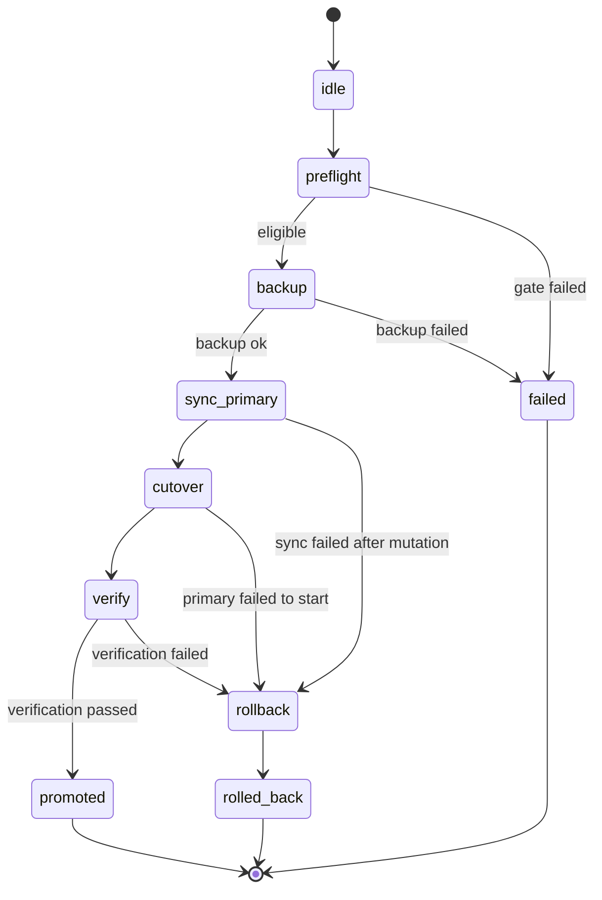

# Official To Primary Promotion Architecture

This document defines how `openclaw-health-monitor` promotes a validated `official` OpenClaw environment into the next `primary` environment.

## 1. Problem Statement

`openclaw-health-monitor` hosts OpenClaw externally and must survive upstream OpenClaw upgrades without patching OpenClaw core.

The system therefore uses two roles:

- `primary`: the current stable production environment
- `official`: the upstream validation environment used to test a newer OpenClaw version under Health Monitor control

These two roles are not meant to live forever as equal peers. The `official` environment exists to validate a candidate upgrade. Once validated, it should be promoted into `primary`, and the old `primary` should become the rollback source.

## 2. Design Goals

- avoid editing OpenClaw upstream code
- keep promotion reversible
- keep promotion observable in Dashboard and Guardian logs
- verify promotion through scripted health checks instead of manual judgment
- preserve operator confidence with explicit preflight, cutover, and rollback stages

## 3. Non-Goals

- no in-place mutation of OpenClaw internals
- no destructive delete-first deployment
- no requirement to keep both versions permanently active after promotion
- no reliance on manual browser checks as the primary success criterion

## 4. Promotion Model

Promotion is a controlled release action, not a directory move.

The source of truth is:

- validated code from `official`
- validated state/config from `official`
- preserved rollback snapshot from current `primary`

The result is:

- `primary` now runs the version previously validated in `official`
- `official` becomes available again as the next validation lane

## 5. Why Not Delete And Move

Delete-and-move is too fragile because this system already has environment-specific:

- launchd labels
- ports
- state directories
- dashboard tokens
- guardian targeting rules
- snapshot/restore paths

A raw move risks path drift, stale references, and unclear rollback.

The safer model is copy/sync + verify + cutover + retain rollback assets.

## 6. Architecture Overview

## 7. Promotion Phases

### Phase A: Eligibility / Preflight

Promotion may start only when all checks pass:

- `official` is the active validation candidate or explicitly selected by operator
- `official` gateway is running
- `official` health check passes
- promotion summary says `safe_to_promote`
- no blocked critical task is active
- snapshot recovery is enabled

Optional but recommended:

- the candidate Git head differs from `primary`
- `official` model path (`gpt/gpt-5.4`) is callable
- at least one subagent verification succeeds

### Phase B: Backup / Rollback Point

Before any mutation:

- capture dual config snapshots using the existing snapshot system
- capture a promotion-specific rollback snapshot for `primary`
- persist the current `primary` Git head and environment metadata
- write a promotion record into change logs and runtime state

This phase must succeed before promotion continues.

### Phase C: Primary Sync

Promotion should update `primary` by synchronization, not replacement.

Sync scope:

- code: sync validated `official` worktree content into `primary` worktree target
- state: sync validated `official` state/config into `primary` state target
- environment-specific rewrite: keep `primary` port, path, and identity values aligned to `primary`

Rules:

- preserve `primary` runtime identity where required for stable hosting
- preserve any `primary`-only launchd/runtime wiring owned by Health Monitor
- never copy stale validation-only paths into production references

### Phase D: Cutover

After sync completes:

- stop the current `primary`
- start `primary` using the normal primary runtime path
- keep `official` stopped during cutover to reduce ambiguity
- record old/new pid and target version metadata

### Phase E: Automated Verification

Promotion success must be proven by automation.

Required checks:

- `primary` listener starts on the expected port
- `primary` health endpoint returns OK
- `openclaw models status` resolves the expected canonical model set
- `openclaw agent --agent main` succeeds on the promoted `primary`
- at least one secondary agent (for example `verifier`) succeeds
- dashboard environment status reflects healthy `primary`

Optional stronger checks:

- compare expected Git head to running `primary`
- verify no unexpected auth providers remain
- verify change-log entry was emitted

### Phase F: Rollback

If any verification step fails:

- stop the failed promoted `primary`
- restore rollback snapshot/state
- restore rollback code revision
- restart old `primary`
- record rollback result in change log and runtime state

Rollback is part of the primary design, not an emergency afterthought.

## 8. Control Plane Responsibilities

### Guardian

Guardian owns:

- promotion preflight gating
- snapshot creation
- promotion orchestration state
- rollback orchestration
- operator-visible log entries

### Dashboard

Dashboard owns:

- promotion readiness summary
- explicit operator trigger
- promotion progress visibility
- success/failure/rollback reporting

### OpenClaw

OpenClaw remains responsible only for:

- gateway startup
- model execution
- subagent execution

Promotion logic stays outside OpenClaw core.

## 9. State Machine

## 10. Required Records

Promotion should persist:

- promotion id
- source environment (`official`)
- target environment (`primary`)
- old primary git head
- promoted git head
- backup snapshot names
- verification results per check
- final outcome: `promoted` / `rolled_back` / `failed_preflight`

## 11. Validation Strategy

Manual validation alone is not acceptable for this feature.

Validation should include:

- unit-level helpers for preflight decision logic
- orchestration tests for promotion state transitions
- smoke verification against the real managed environments when available
- forced-failure path to prove rollback works

Minimum acceptance proof:

- one successful promotion run in a real local environment
- one synthetic failure run that triggers rollback and restores stable `primary`

## 12. Operator UX Expectations

The operator should see:

- whether promotion is currently allowed
- what version/head will be promoted
- what rollback point will be used
- whether automated verification passed
- if rollback happened, exactly why

## 13. Implementation Plan

1. add a promotion controller module in Health Monitor
2. add promotion records to SQLite/runtime state
3. add dashboard action + progress surface
4. add automated verification runner for promoted `primary`
5. add rollback path and failure drills
6. land final operator documentation

## 14. Open Questions

- should `official` be automatically reset/reprepared after a successful promotion, or left as-is until the next explicit validation cycle?
- should code sync use worktree reset, rsync, or a controlled git-based publish step for `primary`?
- which `primary` identity values must always survive promotion even when state is copied from `official`?
