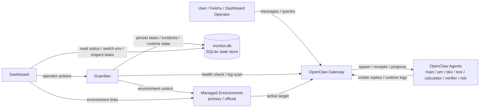
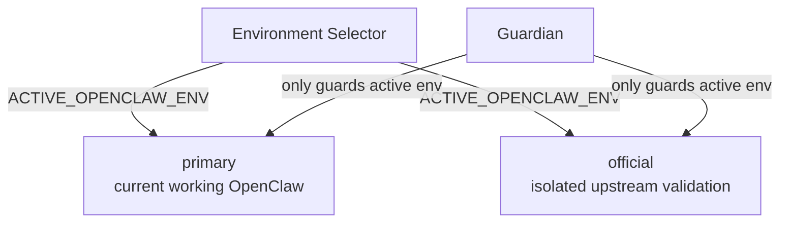
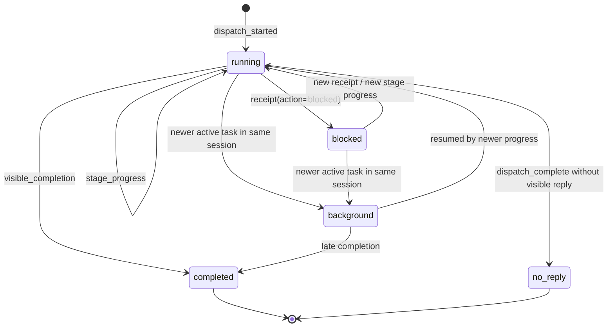

# OpenClaw Health Monitor Architecture

This document describes the production-oriented control-plane architecture used by `openclaw-health-monitor`.

## 1. Control-Plane Overview

## 2. Managed Environment Model

Rules:

- only one OpenClaw environment is active at a time
- Guardian follows the active environment recorded in config and SQLite runtime state
- manual environment switching outside Health Monitor can temporarily desync the panel until the next explicit switch or resync

## 3. External Task Registry

The task registry is intentionally implemented outside OpenClaw itself.

Why:

- avoid patching OpenClaw core
- keep upstream upgrades feasible
- make task tracking consistent across single-agent and multi-agent setups

Core records:

- `managed_tasks`
- `task_events`
- runtime `kv_state`

## 4. Task Lifecycle

## 5. Evidence Model

The control plane treats these as strong runtime evidence:

- `dispatching to agent`
- `PIPELINE_PROGRESS`
- `PIPELINE_RECEIPT`
- visible completion messages
- `dispatch complete`

The control plane should not treat free-form model text as task truth when stronger evidence exists.

## 6. Operator Surfaces

Dashboard exposes:

- incident summary
- environment status and switching
- memory attribution
- task registry summary
- current active task
- recent task timeline

Guardian provides:

- anomaly detection
- silence-based follow-up
- blocked-task handling
- environment-aware recovery

## 7. Design Boundary

OpenClaw core is responsible for:

- execution
- agent orchestration primitives
- channel delivery

Health Monitor is responsible for:

- task tracking
- runtime diagnosis
- version/environment control
- recovery policy
- operator visibility

This separation is what allows Health Monitor to remain robust while OpenClaw itself continues to upgrade upstream.
