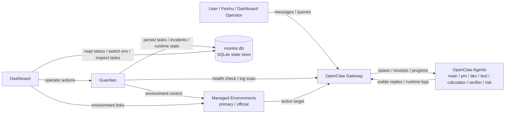
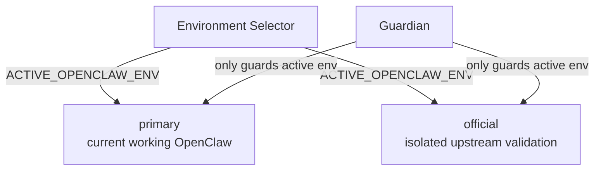
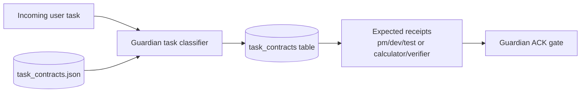
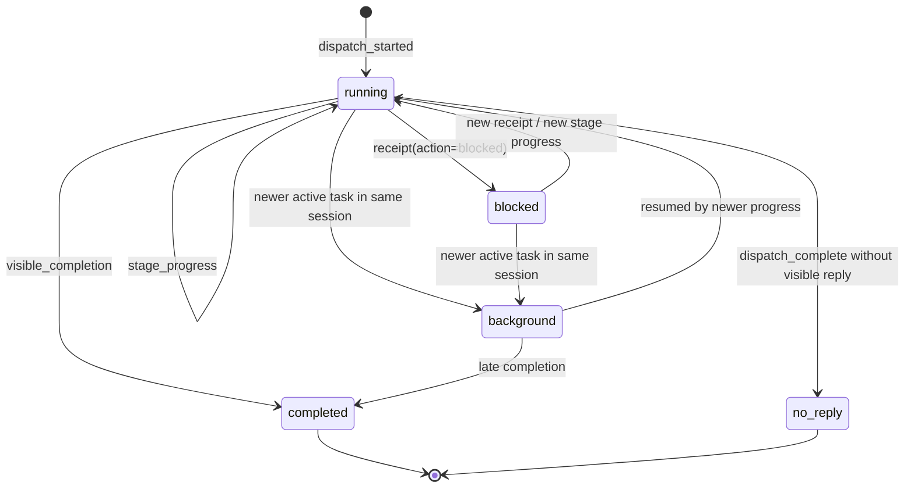
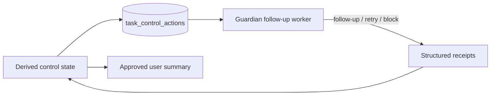

# OpenClaw Health Monitor Architecture

This document describes the production-oriented control-plane architecture used by `openclaw-health-monitor`.

## 1. Control-Plane Overview

## 2. Managed Environment Model

Rules:

- only one OpenClaw environment is active at a time
- Guardian follows the active environment recorded in config and SQLite runtime state
- manual environment switching outside Health Monitor can temporarily desync the panel until the next explicit switch or resync

## 3. External Task Registry

The task registry is intentionally implemented outside OpenClaw itself.

Why:

- avoid patching OpenClaw core
- keep upstream upgrades feasible
- make task tracking consistent across single-agent and multi-agent setups

Core records:

- `managed_tasks`
- `task_events`
- `task_contracts`
- `task_control_actions`
- runtime `kv_state`

## 4. Task Contracts and ACK Gate

Task contracts are external, configurable, and intentionally non-invasive:

- `delivery_pipeline`
  - expects `pm -> dev -> test` receipts
- `quant_guarded`
  - expects `calculator -> verifier` receipts
- `single_agent`
  - no strict contract

Guardian does not trust free-form agent text for pipeline truth. It only advances control states when the expected receipts arrive.

## 5. Task Lifecycle

## 6. Control Actions Queue

Principles:

- the registry is not just a ledger; it emits explicit control actions
- each control action is persisted in SQLite with attempts, last error, and status
- Guardian consumes those actions and either:
  - requests the missing receipt
  - retries after cooldown
  - marks the task blocked
- dashboard and user-facing progress should read the approved state, not free-form agent text

## 7. Evidence Model

The control plane treats these as strong runtime evidence:

- `dispatching to agent`
- `PIPELINE_PROGRESS`
- `PIPELINE_RECEIPT`
- visible completion messages
- `dispatch complete`

The control plane should not treat free-form model text as task truth when stronger evidence exists.

## 8. Control States

Examples:

- `received_only`
  - task was accepted, but no required contract receipts arrived
- `planning_only`
  - planning evidence exists, but `dev` has not started
- `dev_running`
  - `dev` receipt exists
- `awaiting_test`
  - `dev` completed, `test` not started
- `calculator_running`
  - calculator started, waiting for structured result
- `awaiting_verifier`
  - calculator completed, verifier not done
- `blocked_unverified`
  - Guardian escalated because the contract receipts never arrived

## 9. Operator Surfaces

Dashboard exposes:

- incident summary
- environment status and switching
- memory attribution
- task registry summary
- current active task
- recent task timeline
- control actions queue and missing receipts

Guardian provides:

- anomaly detection
- silence-based follow-up
- contract-aware task follow-up
- persisted control actions with retry / block lifecycle
- blocked-task handling
- environment-aware recovery

## 10. Design Boundary

OpenClaw core is responsible for:

- execution
- agent orchestration primitives
- channel delivery

Health Monitor is responsible for:

- task tracking
- runtime diagnosis
- version/environment control
- recovery policy
- operator visibility

This separation is what allows Health Monitor to remain robust while OpenClaw itself continues to upgrade upstream.

## 11. Related Design Docs

- `docs/architecture-official-promotion.md`
  - controlled promotion of validated `official` into stable `primary`
