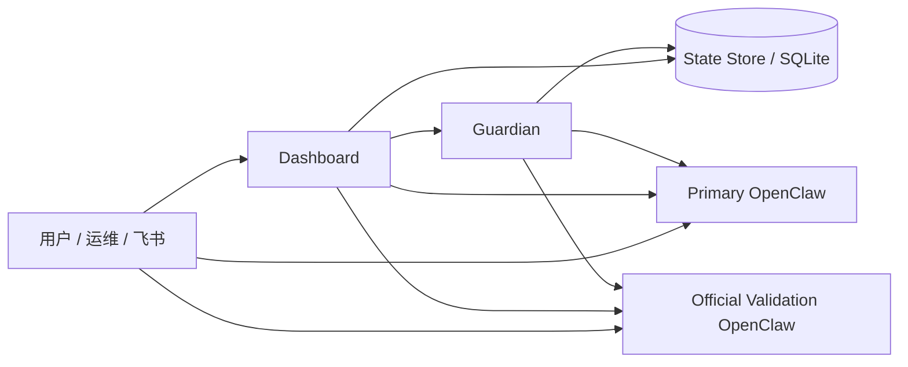

# OpenClaw Health Monitor 产品架构评审稿

本文档用于团队内部评审和对齐。

目标不是解释实现细节，而是回答四个问题：

1. 这个产品现在到底是什么
2. 它由哪些模块构成
3. 当前已经做到哪一步
4. 下一阶段应该先补什么

---

## 1. 一句话定义

`openclaw-health-monitor` 不是一个“看 CPU / 内存的监控页”，而是一层运行治理系统。

它的职责是：

- 把 OpenClaw 从“能跑”提升到“可持续运行”
- 给多环境运行、任务控制、异常恢复、运营观察提供统一控制面

一句话可以概括为：

- `OpenClaw = 执行引擎`
- `Health Monitor = 运行控制面`

---

## 2. 产品目标

当前产品目标可以拆成三层。

### 2.1 P0 运行稳定性

- Gateway、Guardian、Dashboard 可持续运行
- 异常时可自动恢复
- 环境切换和重启行为可控
- 不出现“双环境同时跑但系统自以为单活”的状态漂移

### 2.2 P1 任务可观测性

- 用户消息进入后，系统知道任务是否真的开始
- 任务是否推进、有无卡住、是否真正完成，都有证据链
- 不再只靠模型自由文本判断“做完了”

### 2.3 P2 经验沉淀与进化

- 重复问题被识别
- 学习项被积累
- 阻塞模式被提升为规则或治理经验

---

## 3. 当前总体架构

### 3.1 三个核心运行件

- `Dashboard`
  - 给人看的控制台
- `Guardian`
  - 持续运行的后台治理循环
- `Runtime Controllers`
  - 启停环境、切换环境、准备验证版的控制器

### 3.2 一个核心状态层

- `State Store`
  - 任务、事件、控制动作、learning、reflection、运行态 KV

---

## 4. 模块划分

当前系统可以分成 8 个功能模块。

### 模块 A：环境治理

目标：

- 管理 `primary / official`
- 展示当前激活环境
- 切换环境
- 打开对应 Dashboard
- 管理验证版更新与启动

主要文件：

- [dashboard_backend.py](/Users/hangzhou/openclaw-health-monitor/dashboard_backend.py)
- [desktop_runtime.sh](/Users/hangzhou/openclaw-health-monitor/desktop_runtime.sh)
- [manage_official_openclaw.sh](/Users/hangzhou/openclaw-health-monitor/manage_official_openclaw.sh)

当前判断：

- 能用
- 但“单活约束”仍属于 P0 持续收口项

### 模块 B：运行健康监控

目标：

- 监控 Gateway 是否存活
- 监控 HTTP health 是否正常
- 监控 CPU / 内存 / 慢响应
- 识别 no-reply / stuck / ws closed 等异常

主要文件：

- [guardian.py](/Users/hangzhou/openclaw-health-monitor/guardian.py)
- [dashboard_backend.py](/Users/hangzhou/openclaw-health-monitor/dashboard_backend.py)

当前判断：

- 已基本成型
- 是现在最稳定的能力之一

### 模块 C：任务注册表

目标：

- 从运行日志反推“当前任务”
- 记录 session、question、status、stage、事件时间线
- 给 Dashboard 和 Guardian 提供统一任务事实

主要文件：

- [guardian.py](/Users/hangzhou/openclaw-health-monitor/guardian.py)
- [state_store.py](/Users/hangzhou/openclaw-health-monitor/state_store.py)

当前判断：

- 已经落地
- 但和真实回复链之间还存在证据缺口

### 模块 D：任务合同与控制平面

目标：

- 区分 `single_agent / delivery_pipeline / quant_guarded`
- 明确不同任务需要哪些 receipts
- 对“无回执 / 假完成 / 阻塞”进行控制

主要文件：

- [task_contracts.py](/Users/hangzhou/openclaw-health-monitor/task_contracts.py)
- [task_contracts.json](/Users/hangzhou/openclaw-health-monitor/task_contracts.json)
- [guardian.py](/Users/hangzhou/openclaw-health-monitor/guardian.py)
- [state_store.py](/Users/hangzhou/openclaw-health-monitor/state_store.py)

当前判断：

- 这是当前产品区别于普通监控页的核心模块
- 已经形成产品雏形
- 但协议化程度还不够

### 模块 E：恢复与版本治理

目标：

- 异常时自动重启
- 必要时恢复快照
- 跟踪稳定版本
- 管理验证版更新

主要文件：

- [guardian.py](/Users/hangzhou/openclaw-health-monitor/guardian.py)
- [snapshot_manager.py](/Users/hangzhou/openclaw-health-monitor/snapshot_manager.py)
- [dashboard_backend.py](/Users/hangzhou/openclaw-health-monitor/dashboard_backend.py)

当前判断：

- 已落地
- 但和单活环境约束需要统一收口

### 模块 F：学习与反思

目标：

- 让 OpenClaw 自己沉淀 learning / reflection / promote / reuse
- 让 health-monitor 监督学习是否真的发生
- 让 promoted memory、reflection runs、reuse evidence 可被审计

主要文件：

- [dashboard_backend.py](/Users/hangzhou/openclaw-health-monitor/dashboard_backend.py)
- [state_store.py](/Users/hangzhou/openclaw-health-monitor/state_store.py)
- [learning-reflection-rearchitecture.md](/Users/hangzhou/openclaw-health-monitor/docs/learning-reflection-rearchitecture.md)

当前判断：

- 边界已重新定义清楚
- 但实现仍处于迁移期，guardian 里还有过渡性 learning / reflection 逻辑

### 模块 G：操作员界面

目标：

- 让运维和产品能看见系统现状
- 让切换、重启、恢复、检查有统一入口

主要文件：

- [dashboard_backend.py](/Users/hangzhou/openclaw-health-monitor/dashboard_backend.py)

当前判断：

- 已能支撑日常使用
- 需要继续提升“状态可信度”和“环境辨识度”

### 模块 H：配置与状态存储

目标：

- 把产品的运行参数、状态和事实沉淀在外部
- 不把这些治理逻辑塞进 OpenClaw 本体

主要文件：

- [monitor_config.py](/Users/hangzhou/openclaw-health-monitor/monitor_config.py)
- [state_store.py](/Users/hangzhou/openclaw-health-monitor/state_store.py)

当前判断：

- 方向正确
- 是后续扩展 shared-state 的基础

---

## 5. 现在已经具备的产品能力

如果按“对外能做什么”来讲，当前产品已经具备：

### 5.1 环境侧

- 展示主用版与验证版
- 切换激活环境
- 管理验证版 prepare / start / stop / update
- 给出对应 Dashboard 打开入口

### 5.2 守护侧

- 进程与 HTTP 健康检查
- 慢响应检测
- 无回复检测
- 部分异常自动重启
- 快照恢复

### 5.3 控制侧

- 任务注册表
- 当前任务事实
- 控制动作队列
- 缺失回执识别
- 阻塞任务识别

### 5.4 可视化侧

- Incident Summary
- Environment Cards
- Task Registry
- Control Plane Overview
- Learning Center
- Active Agent Activity

### 5.5 经验沉淀侧

- learning 记录
- reflection 周期执行
- promoted issue 展示

---

## 6. 当前架构最强的部分

如果从产品价值看，当前最强的是两层。

### 6.1 外挂控制平面

这是当前产品的核心竞争力。

我们已经不只是“OpenClaw 出问题了就提醒一下”，而是在做：

- 任务识别
- 状态推断
- 回执校验
- 控制动作
- 阻塞升级

这已经接近“外部任务编排与治理层”。

### 6.2 运行治理与环境治理

双环境、验证版、切换、恢复、重启、快照，这些能力已经形成实际产品价值。

这决定了它不是一个 toy dashboard，而是一个运营系统。

---

## 7. 当前最弱的部分

### 7.1 单活环境还没完全封死

这是当前最重要的运行风险。

产品原则上要求：

- 任何时刻只能有一套 gateway 在跑

但现在还没把所有入口都彻底收拢干净。

这意味着：

- 状态可能看起来切了
- 实际消息却进了另一边

这是当前 P0 风险。

### 7.2 OpenClaw 本体层的 Context OS 还没建起来

从长时间运行系统的角度看，当前最缺的是：

- memory flush
- context pruning
- daily / idle reset
- session maintenance

也就是说，Health Monitor 已经比较像控制面了，但 OpenClaw 本体还不是成熟的“上下文操作系统”。

### 7.3 协作协议还不够 formal

现在已经有很多路由规则，但还没有统一落成：

- `request`
- `confirmed`
- `final`
- `ack_id`
- `final 后静默`

这会让控制平面和多 Agent 协作之间还有一层不稳定地带。

### 7.4 模型侧问题仍然会直接穿透到产品层

比如当前 `gpt-5.4` 的问题，Health Monitor 可以检测并暴露，但不能从根上解决：

- 无效 key
- provider 401
- 上游兼容性问题

这部分需要明确边界。

---

## 8. 当前阶段判断

我对当前产品阶段的判断是：

- 它已经不是“监控脚本集合”
- 也还不是“完整 Agent Operating System”
- 它目前最准确的定位是：

`OpenClaw 外挂运行治理与控制平面产品`

阶段上大概处于：

- `可内部持续使用`
- `架构已成型`
- `关键基线仍需补强`

---

## 9. 下一阶段建议优先级

按重要性排序，我建议这样排：

### P0

- 把“单活环境”彻底做成硬约束
- 所有 start / stop / restart / switch 全部统一走激活环境决策
- 对双监听加自动检查与测试门禁

### P1

- 把控制平面协议再 formal 一层
- 明确 request / confirmed / final / ack_id 规则
- 把“任务真完成”标准继续从自由文本剥离

### P2

- 引入更完整的 context lifecycle 设计
- 让 OpenClaw 本体也具备 memory flush / pruning / reset / maintenance

### P3

- 把 learning / reflection 统一成更清晰的 Agent 记忆架构
- 把现在 data/state 文件进一步整理成正式 shared-state 目录模型

---

## 10. 这份评审稿配套文档

- [product-architecture.md](/Users/hangzhou/openclaw-health-monitor/docs/product-architecture.md)
- [architecture.md](/Users/hangzhou/openclaw-health-monitor/docs/architecture.md)
- [internal-requirements.md](/Users/hangzhou/openclaw-health-monitor/docs/internal-requirements.md)

---

## 11. 评审结论建议

如果用于内部评审，我建议结论写成：

- 方向正确：已经形成外部控制平面与运行治理层
- 产品核心成立：环境治理、任务控制、学习反思都已有雏形
- 当前 P0：单活环境约束必须彻底做实
- 当前 P1：任务协议与回执机制要继续标准化
- 下一阶段重点：把 OpenClaw 本体上下文治理补齐，向“可持续运行 Agent 系统”推进
