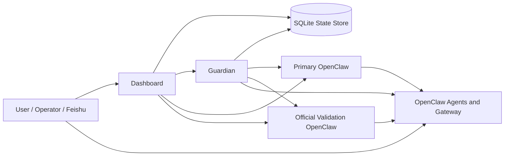

# OpenClaw Health Monitor Product Architecture

This document is the internal product architecture reference for `openclaw-health-monitor`.

It is intentionally broader than `README.md` and broader than the earlier control-plane-only `docs/architecture.md`.
It describes:

- product goals
- system boundaries
- runtime components
- functional modules
- storage and data model
- environment-management model
- task/control-plane model
- learning/reflection supervision model
- current implementation status
- known gaps and next-step priorities

## 1. Product Goal

`openclaw-health-monitor` is not only a health dashboard.

Its real role is to provide an external runtime governance layer for OpenClaw:

- keep OpenClaw continuously operable
- provide environment control for `primary` and `official`
- observe real execution instead of trusting free-form model output
- detect silent failures, stuck tasks, and reply-loss cases
- enforce a task/control protocol outside OpenClaw core
- verify that OpenClaw learning and reflection actually happen

In short:

- OpenClaw is the execution engine
- Health Monitor is the operational control plane

## 2. System Boundary

### 2.1 OpenClaw Core Owns

- channel delivery
- agent execution
- model invocation
- session files and runtime logs
- tool invocation and agent orchestration primitives
- learning capture and `.learnings` writes
- reflection cron and promotion decisions
- durable memory updates and skills reuse

### 2.2 Health Monitor Owns

- process and HTTP health monitoring
- active-environment selection and switching
- isolated validation environment lifecycle
- task registry and control actions
- anomaly detection and runtime diagnosis
- restart / recovery / rollback policy
- operator dashboard
- learning visibility, audit, and verification
- Task Watcher and `completed != delivered` supervision

### 2.3 Design Principle

The monitor is intentionally externalized rather than patching OpenClaw core deeply.

Why:

- upstream OpenClaw can continue to upgrade
- governance logic remains product-owned
- task tracking and recovery policy stay consistent even if OpenClaw internals evolve

## 3. High-Level Architecture

There are three primary runtime pieces in this repository:

- Dashboard: operator surface
- Guardian: background control-plane worker
- Environment managers: shell-based runtime controllers for `primary` and `official`

## 4. Runtime Components

## 4.1 Dashboard

Main file:

- [dashboard_backend.py](/Users/hangzhou/openclaw-health-monitor/dashboard_backend.py)

Responsibilities:

- render the operator UI
- expose `/api/status`
- show environment cards
- expose environment switch and restart APIs
- expose task registry, control plane, learning center, snapshots, and change logs
- provide environment-specific dashboard open links

Key APIs:

- `/api/status`
- `/api/task-registry`
- `/api/learnings`
- `/api/environments/switch`
- `/api/environments/manage`
- `/api/restart`
- `/api/snapshots`
- `/api/config`
- `/open-dashboard/<env_id>`

## 4.2 Guardian

Main file:

- [guardian.py](/Users/hangzhou/openclaw-health-monitor/guardian.py)

Responsibilities:

- periodic health checks
- runtime log scanning
- anomaly detection
- task-registry synchronization from OpenClaw logs
- control-action reconciliation
- follow-up delivery and fallback push behavior
- snapshot creation and rollback
- restart and update orchestration
- learning freshness / reflection freshness audit
- shared-state export for backlog, promoted items, and watcher status

Guardian is the core automation loop of the product.

## 4.3 Runtime Controllers

Main files:

- [desktop_runtime.sh](/Users/hangzhou/openclaw-health-monitor/desktop_runtime.sh)
- [manage_official_openclaw.sh](/Users/hangzhou/openclaw-health-monitor/manage_official_openclaw.sh)

Responsibilities:

- start / stop Dashboard
- start / stop Guardian
- start / stop current active gateway
- prepare and update isolated `official` worktree
- bootstrap launch agents
- enforce environment-specific gateway startup

## 4.4 Configuration Layer

Main file:

- [monitor_config.py](/Users/hangzhou/openclaw-health-monitor/monitor_config.py)

Responsibilities:

- load tracked config and local override config
- save local override values
- sanitize config for UI display

Primary config sources:

- [config.conf](/Users/hangzhou/openclaw-health-monitor/config.conf)
- [config.local.conf](/Users/hangzhou/openclaw-health-monitor/config.local.conf)

## 4.5 Persistent State Layer

Main file:

- [state_store.py](/Users/hangzhou/openclaw-health-monitor/state_store.py)

Responsibilities:

- persist runtime change logs
- persist task registry
- persist task events
- persist task contracts
- persist task control actions
- persist runtime kv-state
- persist learnings and reflection runs
- summarize control-plane state for Dashboard

The state store records monitor-visible learning facts, but it is not the source of truth for OpenClaw's cognitive decisions.

This is the long-lived product memory for the monitor itself.

## 5. Managed Environment Model

The product supports two OpenClaw environments:

- `primary`
  - the current working environment
- `official`
  - isolated validation environment tracking the configured remote ref

Environment metadata is resolved in Dashboard via:

- `active_env_id(...)`
- `get_env_specs(...)`
- `env_spec(...)`

Key config fields:

- `ACTIVE_OPENCLAW_ENV`
- `OPENCLAW_HOME`
- `OPENCLAW_CODE`
- `GATEWAY_PORT`
- `OPENCLAW_OFFICIAL_STATE`
- `OPENCLAW_OFFICIAL_CODE`
- `OPENCLAW_OFFICIAL_PORT`
- `OPENCLAW_OFFICIAL_REF`

### 5.1 Intended Invariant

The intended product invariant is:

- only one environment may be active
- all start / stop / restart actions must resolve through `ACTIVE_OPENCLAW_ENV`
- the inactive environment must not keep a running gateway

This invariant is now also documented in:

- [internal-requirements.md](/Users/hangzhou/openclaw-health-monitor/docs/internal-requirements.md)

### 5.2 Actual Current Status

The product intends single-active-environment behavior, but this is still an active stabilization area.

Recent fixes already landed for:

- Dashboard restart respecting the active environment
- Guardian restart respecting the active environment
- runtime `start gateway` routing through the active-environment controller

However, this remains a live operational risk and should still be treated as a release-critical invariant until all entry points are fully sealed.

## 6. Environment Lifecycle

### 6.1 Primary

`primary` is the local working OpenClaw install.

It uses:

- code: `/Users/hangzhou/openclaw-workspace/openclaw`
- state: `~/.openclaw`

### 6.2 Official

`official` is an isolated validation install created from the configured upstream ref.

Manager:

- [manage_official_openclaw.sh](/Users/hangzhou/openclaw-health-monitor/manage_official_openclaw.sh)

Flow:

1. ensure worktree
2. sync selected private state into isolated state dir
3. rewrite relevant paths from source to target
4. rotate gateway token
5. build the isolated repo
6. launch a dedicated gateway on the official port

### 6.3 Official Dashboard Open Path

The monitor generates environment-specific dashboard URLs from:

- gateway token
- gateway URL
- control UI build status

This avoids ambiguous generic dashboard jumps.

## 7. Functional Module Map

The current product can be viewed as 8 functional modules.

## 7.1 Environment Governance

What it does:

- show `primary` and `official`
- show code path, state path, git head, target head, running and healthy state
- switch active environment
- manage official prepare / start / stop / update
- open the correct dashboard only for the active environment

Primary files:

- [dashboard_backend.py](/Users/hangzhou/openclaw-health-monitor/dashboard_backend.py)
- [desktop_runtime.sh](/Users/hangzhou/openclaw-health-monitor/desktop_runtime.sh)
- [manage_official_openclaw.sh](/Users/hangzhou/openclaw-health-monitor/manage_official_openclaw.sh)

## 7.2 Runtime Health Monitoring

What it does:

- check gateway process
- check gateway health endpoint
- inspect CPU and memory
- identify slow or stuck sessions
- produce diagnoses and operator hints

Primary files:

- [guardian.py](/Users/hangzhou/openclaw-health-monitor/guardian.py)
- [dashboard_backend.py](/Users/hangzhou/openclaw-health-monitor/dashboard_backend.py)

## 7.3 Task Registry

What it does:

- infer tasks from runtime logs
- assign `task_id`, `session_key`, `env_id`, `status`, `current_stage`
- persist events such as dispatch, progress, blocked, completion
- maintain current-task snapshots

Primary files:

- [guardian.py](/Users/hangzhou/openclaw-health-monitor/guardian.py)
- [state_store.py](/Users/hangzhou/openclaw-health-monitor/state_store.py)

## 7.4 Task Contracts

What it does:

- map tasks into contracts like `single_agent`, `delivery_pipeline`, `quant_guarded`
- determine what receipts are required
- decide whether a task can be trusted as completed

Primary files:

- [task_contracts.py](/Users/hangzhou/openclaw-health-monitor/task_contracts.py)
- [task_contracts.json](/Users/hangzhou/openclaw-health-monitor/task_contracts.json)

## 7.5 Control Plane

What it does:

- derive task control states
- generate control actions
- retry follow-ups when required receipts are missing
- mark tasks blocked when evidence never arrives
- keep an approved operator-facing summary separate from free-form agent output

Primary files:

- [guardian.py](/Users/hangzhou/openclaw-health-monitor/guardian.py)
- [state_store.py](/Users/hangzhou/openclaw-health-monitor/state_store.py)
- [dashboard_backend.py](/Users/hangzhou/openclaw-health-monitor/dashboard_backend.py)

## 7.6 Recovery and Version Operations

What it does:

- restart gateways
- detect config changes
- create snapshots
- restore latest or selected snapshots
- track stable version state
- update official validation environment

Primary files:

- [guardian.py](/Users/hangzhou/openclaw-health-monitor/guardian.py)
- [snapshot_manager.py](/Users/hangzhou/openclaw-health-monitor/snapshot_manager.py)
- [dashboard_backend.py](/Users/hangzhou/openclaw-health-monitor/dashboard_backend.py)

## 7.7 Learning and Reflection Supervision

What it does:

- display learning backlog and promoted items
- expose reflection history and freshness
- verify whether learning outputs landed in durable files
- track whether repeated failures are going down over time

Primary files:

- [state_store.py](/Users/hangzhou/openclaw-health-monitor/state_store.py)
- [dashboard_backend.py](/Users/hangzhou/openclaw-health-monitor/dashboard_backend.py)
- [learning-reflection-rearchitecture.md](/Users/hangzhou/openclaw-health-monitor/docs/learning-reflection-rearchitecture.md)

Ownership note:

- OpenClaw owns learn / reflect / promote / reuse
- Health Monitor owns visibility / audit / verification

## 7.8 Operator UI

What it shows:

- environment cards
- incident summary
- memory usage and top processes
- task registry summary
- current active task
- control queue
- learnings
- reflections
- active agent activity

Primary file:

- [dashboard_backend.py](/Users/hangzhou/openclaw-health-monitor/dashboard_backend.py)

## 8. Storage Model

The product uses several storage classes.

## 8.1 Config Files

- `config.conf`
- `config.local.conf`

Use:

- runtime and product configuration

## 8.2 SQLite State Store

Managed by:

- [state_store.py](/Users/hangzhou/openclaw-health-monitor/state_store.py)

Use:

- long-lived operational state
- tasks
- task events
- contracts
- control actions
- learnings
- reflection runs
- runtime kv-state

These records are external supervisory evidence, not the canonical execution-time learning engine.

## 8.3 Change Logs and Snapshots

Use:

- historical operator-facing changes
- recovery points

Paths:

- [change-logs](/Users/hangzhou/openclaw-health-monitor/change-logs)
- [snapshots](/Users/hangzhou/openclaw-health-monitor/snapshots)

## 8.4 Derived Data Files

Use:

- dashboard-compatible current summaries
- current-task fact outputs
- registry snapshots

Path:

- [data](/Users/hangzhou/openclaw-health-monitor/data)

These act as a practical shared-state layer for the current product, even though they are not yet normalized into a formal `shared-context/` directory model.

## 9. Task and Evidence Model

The control plane does not trust arbitrary agent prose as task truth.
It treats the task registry as derived operator state, while OpenClaw native session/runtime state remains authoritative.

It prefers stronger runtime evidence such as:

- `dispatching to agent`
- `PIPELINE_PROGRESS`
- `PIPELINE_RECEIPT`
- visible completion markers
- `dispatch complete`

Task lifecycle examples:

- accepted but no receipts: `received_only`
- planning present, execution missing: `planning_only`
- downstream work started: `dev_running` or `calculator_running`
- execution missing final validation: `awaiting_test` or `awaiting_verifier`
- no trustworthy closure after retries: `blocked`

This is the key product distinction between:

- "model said it was done"
- "system has evidence it was done"

## 10. Current Product Fit Against Long-Running Agent Architecture

The current product already aligns with a stronger long-running-agent philosophy in several ways.

### 10.1 Already Present

- external control plane
- task registry
- asynchronous state persistence
- learning / reflection loop
- environment governance
- operator-visible anomaly detection

### 10.2 Partially Present

- `AGENTS.md` / `SOUL.md` / `Skills` layering in the OpenClaw workspace
- memory folder usage
- task contract classification
- native-vs-derived truth separation in the control plane

### 10.3 Still Missing

- first-class context lifecycle OS at OpenClaw config level
- formal multi-agent request / confirmed / final protocol with `ack_id`
- normalized shared-state folder structure
- a standardized `.learnings/` filesystem contract across agents
- stronger async watcher model for external deliverables

## 11. Current Implementation Status

As of now, the product should be understood as:

- a mature external governance layer around OpenClaw
- strong in runtime control and operator visibility
- medium maturity in task protocol enforcement
- weak in first-class context lifecycle management inside OpenClaw core config

More concretely:

- strong: dashboard, guardian loop, task registry, control actions, learning center
- medium: environment switching, restart discipline, official validation isolation
- weak: single-active-environment hard guarantee across all possible entry points
- weak: upstream model/provider reliability when custom providers reject auth

## 12. Known Current Gaps

The main current gaps are the following.

## 12.1 Single-Active-Environment Is Not Fully Sealed

Intended behavior:

- only one of `primary` or `official` should be listening

Current reality:

- some runtime paths have already been fixed
- but this remains an active regression risk and must continue to be treated as a P0 runtime invariant

## 12.2 Model Invocation Reliability Is Outside the Monitor Boundary

The monitor can:

- surface the failure
- detect no-reply / blocked outcomes
- restart and recover runtimes

The monitor cannot solve:

- invalid upstream API keys
- provider-specific auth rejection
- upstream response incompatibility

That boundary must stay explicit.

## 12.3 Context Lifecycle Is Underpowered

Current OpenClaw configs only show light compaction and no full lifecycle governance:

- no memory flush strategy
- no TTL pruning
- no daily or idle reset policy
- no explicit session maintenance budget

This is the biggest architecture gap if the product goal is true long-running autonomous operation.

## 12.4 Agent Collaboration Protocol Is Not Yet Formalized Enough

The current workspace has routing rules and behavior rules, but not yet:

- universal `ack_id`
- strict `request / confirmed / final`
- final-state silence rule as a product-level protocol

## 13. Recommended Next Priorities

If the product goal is "continuously running agent system", the next priorities should be:

1. Seal the single-active-environment invariant completely.
2. Introduce a formal active-environment restart and startup contract for every entry point.
3. Upgrade OpenClaw config toward true context lifecycle governance.
4. Normalize shared-state and learning directories into a documented product contract.
5. Add a formal collaboration protocol for multi-agent ack/final behavior.
6. Expand task watcher logic for external deliverable verification.

## 14. Related Internal Documents

- [architecture.md](/Users/hangzhou/openclaw-health-monitor/docs/architecture.md)
- [internal-requirements.md](/Users/hangzhou/openclaw-health-monitor/docs/internal-requirements.md)
- [incidents-2026-03-10-dashboard-auth.md](/Users/hangzhou/openclaw-health-monitor/docs/incidents-2026-03-10-dashboard-auth.md)
- [incidents-2026-03-10-single-active-env.md](/Users/hangzhou/openclaw-health-monitor/docs/incidents-2026-03-10-single-active-env.md)
